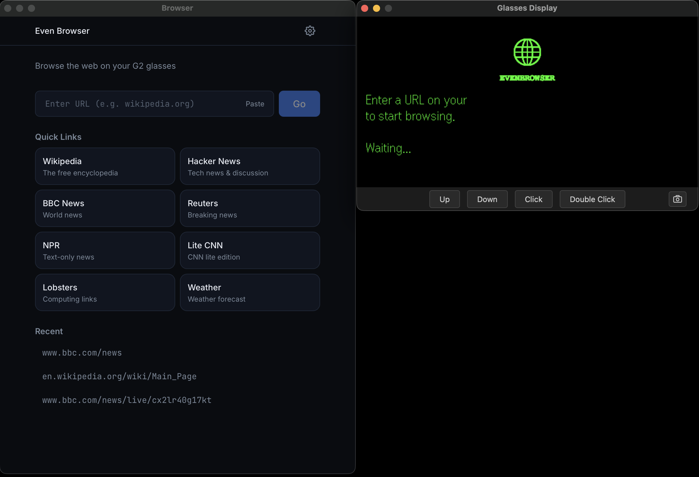
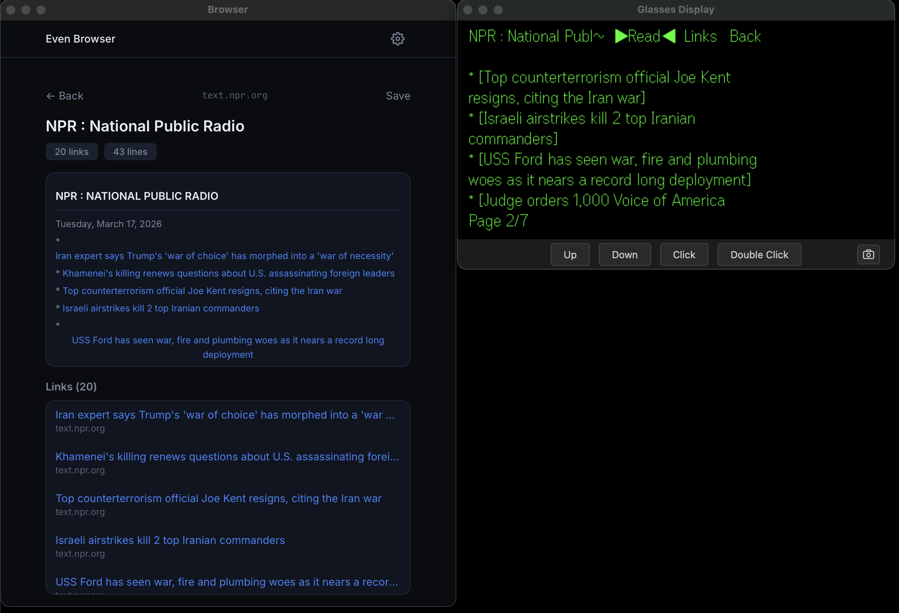
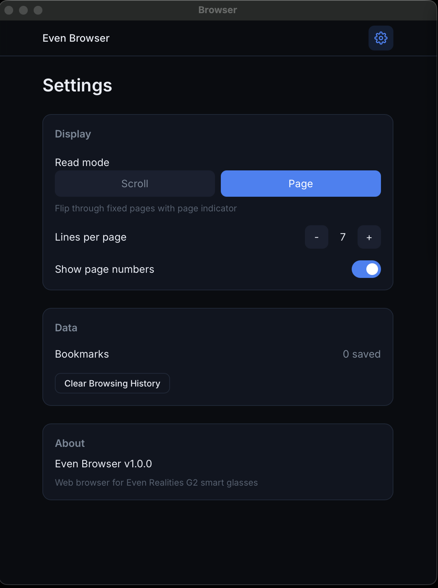
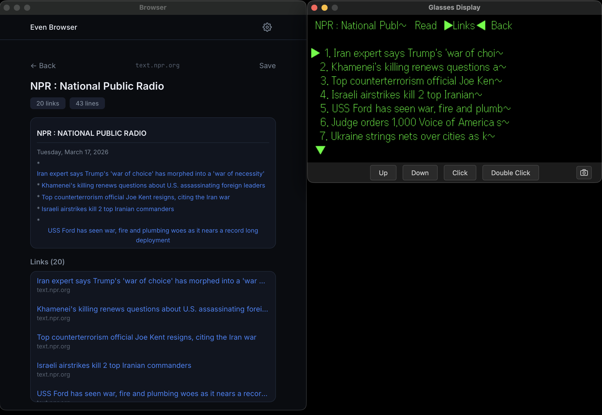

# EvenBrowser

A hands-free web browser for **Even Realities G2 glasses**. Enter a URL on your phone, read web content on your glasses — follow links, navigate back, bookmark pages, all hands-free.

**Try it now** — scan with Even Hub:


**GitHub:** [github.com/fabioglimb/even-browser](https://github.com/fabioglimb/even-browser)

---

## Features

### Web Browsing on Glasses
- Enter any URL on your phone, read the page content on your G2 glasses
- Intelligent HTML parsing extracts readable text from any website
- Links shown as `[Link Text]` markers inline with content
- Dedicated link navigation mode — scroll through links, tap to follow

### Navigation
- Full browser history stack (up to 20 entries)
- Back navigation restores previous page and scroll position
- Double-tap for quick back at any time
- Forward/back on phone UI mirrors glasses state

### Bookmarks
- Save any page with one tap
- Bookmarks persist across sessions
- Quick access from the home screen

### Quick Links
- Predefined shortcuts to text-friendly sites
- Wikipedia, Hacker News, BBC News, Reuters, NPR, and more

### Phone UI
- URL bar with paste support
- Page preview with clickable links
- Link count and line count badges
- Bookmark management
- Browsing history

### Settings
- Configurable lines per page for glasses display
- Page number toggle
- Clear browsing history

---

## G2 Glasses Integration

EvenBrowse is built for the G2 display. Every interaction is designed for scroll + tap navigation.

### Glasses: Home / Waiting
- Globe logo with instructional text
- "Enter a URL on your phone to start browsing."

### Glasses: Loading
- Shows "Loading..." with target domain
- Tap or double-tap to cancel

### Glasses: Page View — Read Mode
- Page title + action bar (`▶Read◀ Links Back`) in header
- Content scrolls line by line (9 visible lines)
- Scroll indicators (▲/▼) when more content above/below
- Tap to exit back to button select

### Glasses: Page View — Links Mode
- Numbered link list with highlight marker (▸)
- Scroll to navigate between links
- **Tap to follow the highlighted link** — loads new page
- Double-tap to exit back to button select

### Glasses: Page View — Button Select
- Scroll between Read / Links / Back buttons
- Tap to activate selected button
- Double-tap for browser back (pops history)

### Glasses: Error
- Error message with Retry / Back buttons
- Tap Retry to re-fetch, Back to return

### Interaction Summary

| Screen | Scroll | Tap | Double-tap |
|--------|--------|-----|------------|
| Waiting | — | — | — |
| Loading | — | Cancel | Cancel |
| Page View (buttons) | Move between buttons | Activate button | Browser back |
| Page View (read) | Scroll content | Exit to buttons | Exit to buttons |
| Page View (links) | Move link highlight | **Follow link** | Exit to buttons |
| Error | Move Retry/Back | Activate | Browser back |

---

## Screenshots

### Phone UI

| Home | Page View | Settings |
|------|-----------|----------|
|  |  |  |

### Glasses Simulator

| Links Mode |
|------------|
|  |

---

## Demo

https://github.com/user-attachments/assets/demo.mov

---

## Tech Stack

- **React 19** + **TypeScript** + **React Router 7**
- **Tailwind CSS 4** with CVA (Class Variance Authority)
- **Even Realities SDK** (`@evenrealities/even_hub_sdk` + `@jappyjan/even-better-sdk`)
- **even-toolkit** shared library for glasses display, action mapping, splash screens
- **Vite 5** with custom CORS proxy plugin for server-side URL fetching
- All data stored locally in **localStorage** — no server, no user data collection

## Project Structure

```
even-browser/
  vite-plugin.ts                 # CORS proxy + resolve aliases (even-dev compatible)
  src/
    App.tsx                      # Routes + providers
    main.tsx                     # Entry point
    types/index.ts               # PageData, PageLink, Bookmark, BrowseSettings
    lib/
      html-parser.ts             # HTML → PageData (DOM walk, link extraction, word-wrap)
      url-utils.ts               # URL resolution, domain extraction, normalization
      text-clean.ts              # G2 Unicode cleaning (strip emojis, unsupported chars)
    data/
      persistence.ts             # localStorage: bookmarks, history, settings
      quick-links.ts             # Predefined site shortcuts
    contexts/
      BrowseContext.tsx           # Full browser state (page, history stack, loading, error, bookmarks)
    hooks/
      useBrowse.ts               # Browse context wrapper
      useContentSearch.ts        # Search within page text
    glass/
      BrowseGlasses.tsx          # useGlasses hook wiring
      selectors.ts               # DisplayData for all screens + modes
      actions.ts                 # Glass action handler (read, links, back, follow link)
      splash.ts                  # Globe splash screen (2 vertical tiles)
    screens/
      Home.tsx                   # URL input + quick links + bookmarks + history
      PageView.tsx               # Phone-side page preview with clickable links
      Settings.tsx               # Display prefs, cache management
    components/
      ui/                        # Button, Card, Badge, Input (CVA)
      shared/                    # UrlBar, QuickLinks, LinkList, BookmarkCard
    utils/cn.ts                  # Tailwind class merge
    styles/app.css               # Blue/teal dark theme
```

## Getting Started

```bash
# Install dependencies
npm install

# Start development server
npm run dev

# Build for production
npm run build

# Run with Even Hub Simulator (two terminals)
npm run dev                    # Terminal 1
npx @evenrealities/evenhub-simulator@latest http://127.0.0.1:5179   # Terminal 2

# Or via even-dev launcher
cd ../even-dev
APP_PATH=../even-browser ./start-even.sh even-browser

# Generate QR code for real G2 glasses testing
npx @evenrealities/evenhub-cli qr --port 5179 --path / --ip <your-local-ip>
```

## How It Works

```
Phone UI (enter URL)
    ↓
Vite proxy (/__browse_proxy) fetches HTML server-side (avoids CORS)
    ↓
DOMParser → walk DOM → extract blocks + links → clean for G2
    ↓
Word-wrap to 46 chars/line → PageContentLine[]
    ↓
DisplayData → useGlasses → G2 glasses
    ↓
User taps a link on glasses → push to history → fetch new page → repeat
```

## License

MIT
